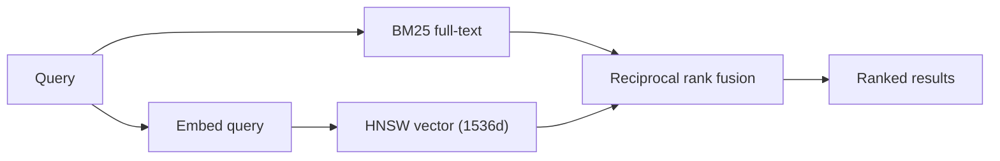

# Memory Model

Two orthogonal axes: **scope** decides who can see a memory, **type** decides
what kind of thing it is.

## Scopes

| Scope | Writer | Reader | Use |
|---|---|---|---|
| `Global` | system/admin | everyone | Shared knowledge |
| `Agent` | matching `agent_id` | matching `agent_id` | Per-agent context |
| `User` | matching `user_id` | matching `user_id` | Personalization |
| `Session` | matching `session_id` | matching `session_id` | Conversation state |
| `Task` | TaskStream API | TaskStream API | Long-running work |

Scope is enforced in the query, not by convention. A cross-scope read matches
zero rows rather than returning data the caller should not see.

:::warning CLI and agent consumers
For non-web consumers, set `user_id = "anonymous"` so queries filter on
`agent_id` rather than `user_id`. Setting `user_id = agent_id` produces
empty search results — a real bug found during WISC integration.
:::

## Types

| Type | Holds | Typical importance |
|---|---|---|
| `Semantic` | Facts, knowledge | 0.5 |
| `Episodic` | Events, decisions, handoffs | 0.9–1.0 |
| `Procedural` | How-to, error resolutions | 0.8 |
| `Associative` | Connections between concepts | varies |

The distinction is not cosmetic. Retrieval scoring weights importance, recency,
and access count differently, so an episodic decision outranks a passing semantic
fact when both match a query.

## Retrieval

`hybrid_search_memories` is the primary path. It runs BM25 full-text and HNSW
vector search, then merges with **reciprocal rank fusion** rather than a score
threshold — the two indexes produce incomparable scores, so RRF combines rank
positions instead.

Both indexes must exist for hybrid search to behave correctly; they are created
by migrations v5 and v6.

## Vector spaces

Two independent spaces that must never be mixed:

| Space | Dimensions | Migration |
|---|---|---|
| memory + entity | 1536 | v5 |
| palace `drawers` | 384 | v16 |

An index whose dimension disagrees with the active embedding provider fails at
query time, not at write time — which makes it a slow failure to diagnose.

## Audit trail

Every mutation writes a `memory_history` row recording version, prior content,
new content, timestamp, and change type. Deletion is included: `delete_memory`
writes the audit row and removes the record **in one transaction**, so history
can never describe a deletion that did not happen, or miss one that did.
