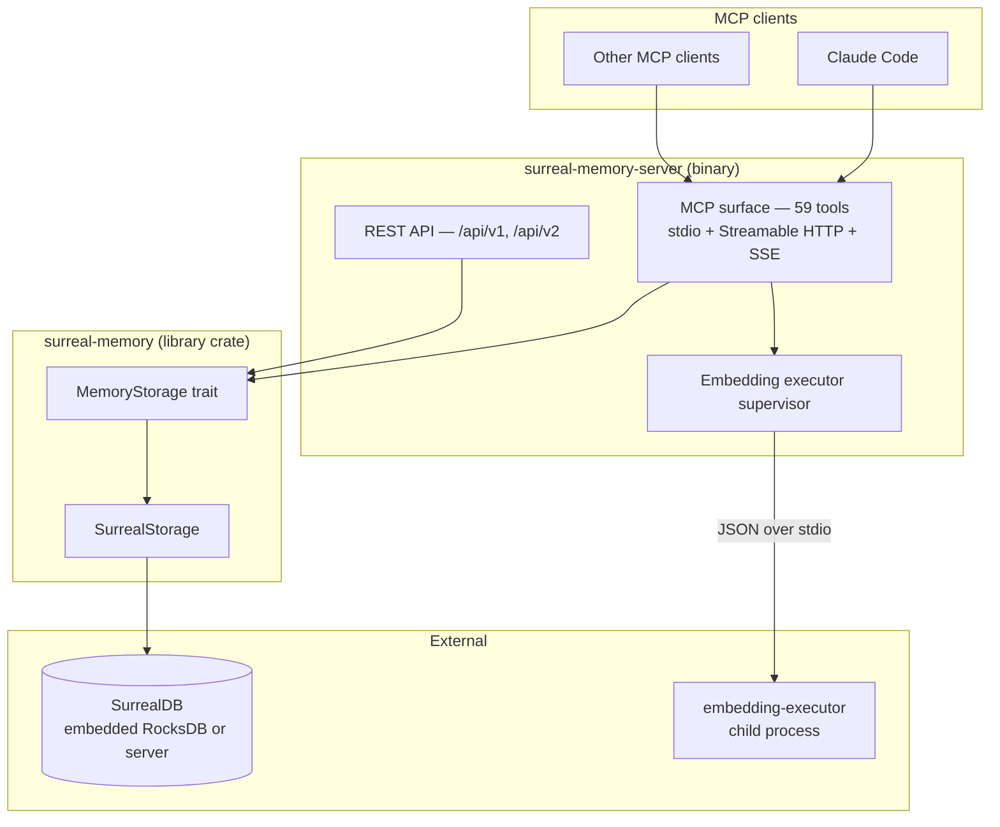

# Architecture Overview

Three layers, each with a deliberate boundary.

## The three boundaries

### 1. `MemoryStorage` — the published interface

A trait of roughly 50 methods in `crates/surreal-memory/src/storage/mod.rs`.
Consumers depend on the trait, never on `SurrealStorage` directly. The Universal
Agent Runtime wraps every method with scope enforcement and `UserContext` checks,
so a change to this surface ripples outward — it is treated as a stable API.

### 2. SurrealDB — schema-governed persistence

All persistence runs through migrations (currently **21**). Tables are
`SCHEMAFULL`, which means an undeclared field is a runtime rejection, not a
silent write. That strictness is deliberate and has a maintenance cost: every
field added to a persisted Rust struct requires a matching migration.

### 3. The embedding executor — an isolated child process

Embedding runs in a **separate process**, not in-process, communicating with the
supervisor over JSON on stdio.

This is the least obvious decision in the system, and the most load-bearing.
Local embedding means Candle plus a GPU backend (Metal or CUDA). That stack can
crash, hang, or exhaust memory in ways safe Rust cannot contain. Isolating it
means a bad model load kills a replaceable child rather than the server holding
your agent's memory.

The supervisor tracks child generations, restarts on failure, and enforces two
distinct budgets:

| Budget | Default | Covers |
|---|---|---|
| `SURREAL_EXECUTOR_STARTUP_MS` | 300s | Process start → readiness signal |
| `SURREAL_EXECUTOR_WATCHDOG_MS` | 30s | Per-request progress once serving |

These are separate because they measure different things. Startup covers process
exec, dynamic linking of a large GPU-linked binary, and driver initialization —
a phase during which the child produces no output at all. Holding that phase to a
short progress watchdog kills healthy children; see
[Design decisions](../design-decisions.md).

## Deployment shapes

**Embedded** (`embedded` feature) — SurrealDB runs in-process over RocksDB. One
process, no external database. RocksDB's stripe locking means concurrent
transactions on overlapping keys serialize in the storage engine, so in-flight
operations are bounded by a semaphore (`SURREAL_EMBEDDED_MAX_INFLIGHT`,
default 16, matching the default stripe count).

**Server** (`server-only`) — connects to an external SurrealDB. Required when
multiple processes share a database; RocksDB cannot be opened by more than one
process at a time.
